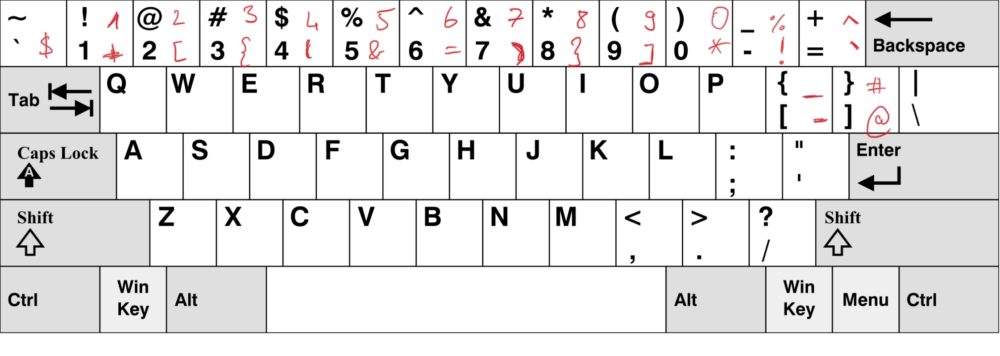
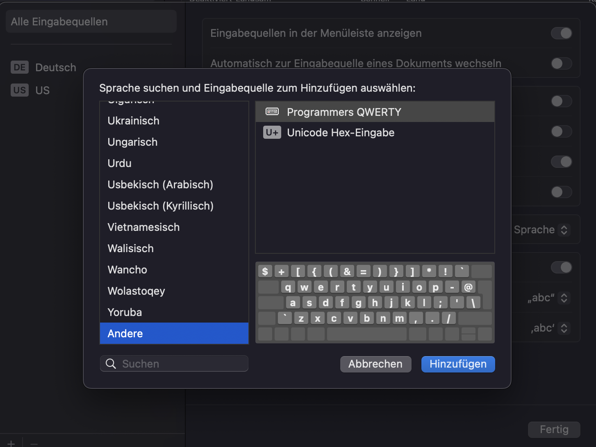

# Programmers QWERTY
A keyboard remapping for Ubuntu inspired by programmers Dvorak. The remapping looks like this

The old QWERTY layout is shown in black and the remappings are written in red.

## Linux
To apply this remapping to your machine copy .Xmodmap and run
```bash
xmodmap /path/to/.Xmodmap
```

## MacOS
Download the ```programmers\_qwerty.keylayout``` file and move it to ```~/Library/Keyboard\ Layout```. The new keyboard layout should now appear under Settings/Keyboard/Text Input. There you can add a new input source. The programmers QWERTY layout should be under 'other'.

