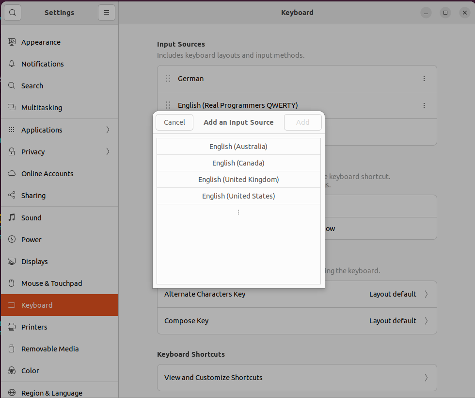
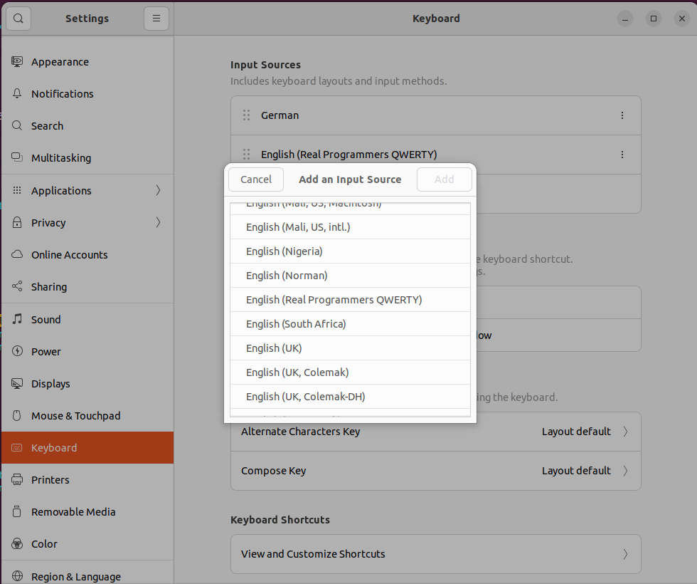

# Linux Installation

The keyboard mappings defined in ```real-programmers-qwerty``` have to be inserted into 
the keyboard layout system definitions. For this open the layouts for the US keyboard
by running
```
sudo vim /usr/share/X11/xkb/symbols
```
And add the content of ```real-programmers-qwerty``` to that file somewhere after the definition
of the defaul US keyboard. Then tell the system about the existence of the new layout by
modifying evdev.xml by running
```
sudo vim /usr/share/X11/xkb/rules/evdev.xml
```
Searh for "English" and you should find the default english keyboard
```xml
<layoutList>    
    <layout>
      <configItem>
        <name>us</name>
        <!-- Keyboard indicator for English layouts -->
        <shortDescription>en</shortDescription>
        <description>English (US)</description>
        <languageList>
          <iso639Id>eng</iso639Id>
        </languageList>
      </configItem>
```
Under the default layout the variants are defined under the variant list. Add the
new keyboard layout to the variant list
```xml
	<variant>
          <configItem>
	    <name>real-prog-qwerty</name>
	    <description>English (Real Programmers QWERTY)</description>
	    <vendor>Einezahl</vendor>
	  </configItem>
	</variant>
```
After a restart you can add the new keyboard layout under Settings->Keyboard->Input Sources.
Add a new keyboard layout

Select English (United States) or a different parent keyboard layout that you chose and
add English (Real Programmers QWERTY).

